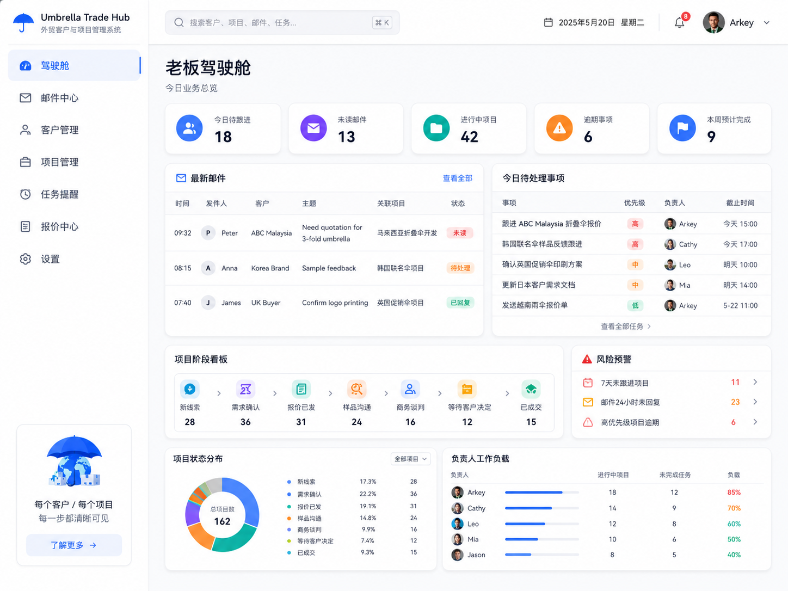
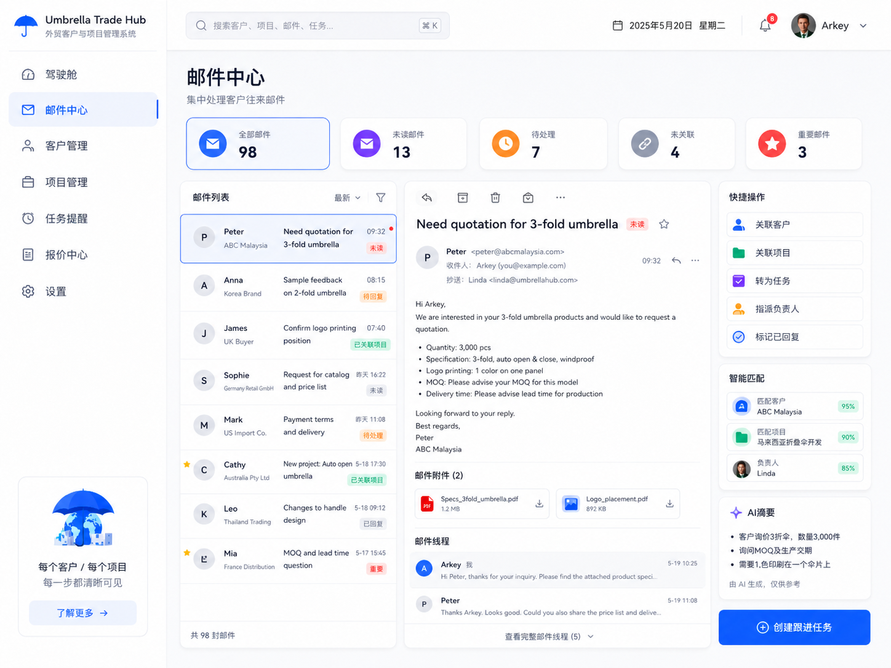
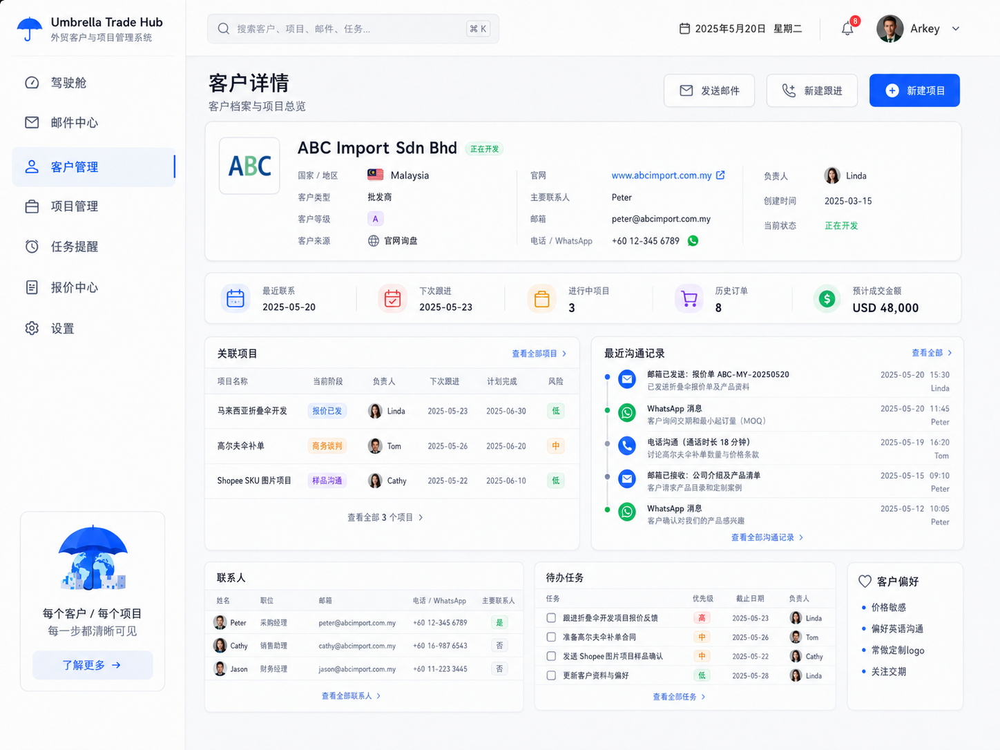
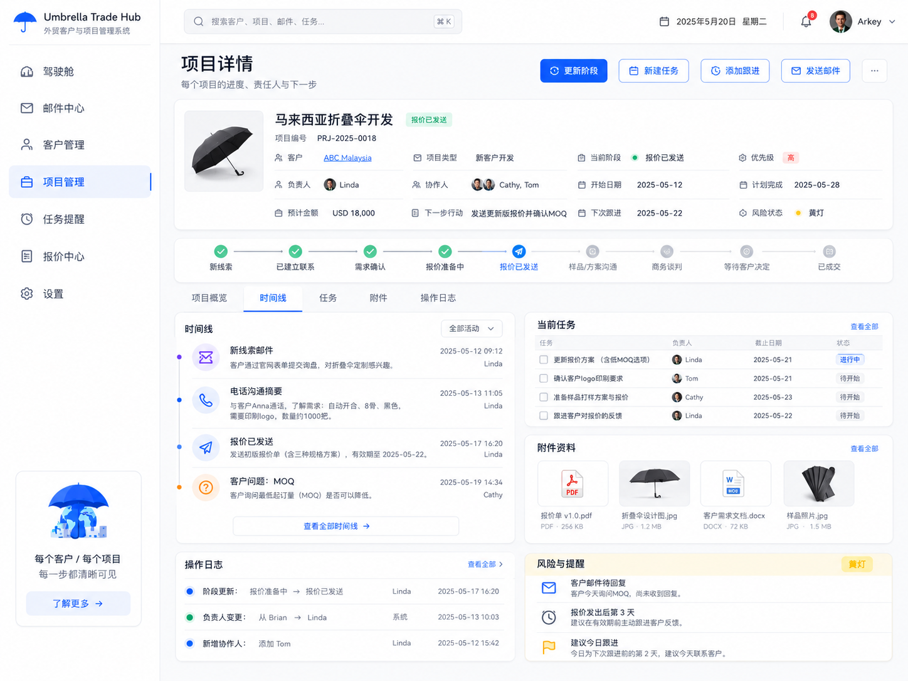
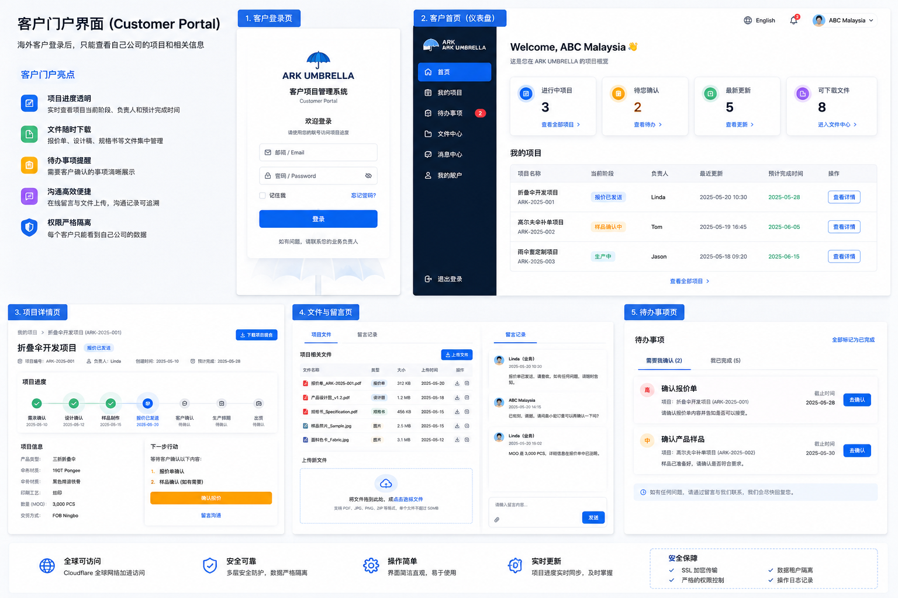

# 雨伞外贸客户项目管理系统规划文档

> 版本：V1.0  
> 适用对象：雨伞外贸公司老板、业务团队、开发团队  
> 系统定位：外贸客户与项目管理系统，不是传统 ERP。  
> 核心目标：让老板每天登录系统后，能够快速掌握最新邮件、客户项目进展、负责人、完成时间、风险事项，并支持海外客户登录查看自己项目的进度。

---

# 1. 项目背景

目前公司在客户跟进、项目推进、邮件处理、任务分配、进度查看方面，容易出现以下问题：

- 客户邮件分散，重要来信容易遗漏
- 每个客户可能有多个项目，项目状态不够清晰
- 老板无法一眼看出当前所有项目进行到哪一步
- 项目负责人、计划完成时间、逾期风险不够透明
- 客户需要反复询问项目进度，沟通成本高
- 后续若要扩展到报价、订单、生产、财务，对现有流程缺少统一接口

因此，第一阶段不做笨重 ERP，而是先建设一套：

## 外贸客户项目管理系统

重点解决：

1. 老板驾驶舱
2. 最新邮件查看
3. 客户管理
4. 项目跟踪
5. 任务提醒
6. 客户门户
7. 模块化架构与后续扩展能力

---

# 2. 系统总体定位

## 2.1 系统名称建议

可暂定为：

- Umbrella Trade Hub
- 外贸客户项目管理系统
- Ark Umbrella Client & Project Hub

---

## 2.2 系统目标

系统上线后，希望实现：

- 每天登录首页即可看到业务全局
- 最新客户邮件集中展示
- 每个客户、每个项目都有清晰进度
- 知道当前阶段、负责人、截止时间、下一步动作
- 系统自动提示逾期和风险
- 客户可通过门户查看属于自己的项目进展
- 后续可继续对接报价、订单、生产、财务、AI 自动总结等模块

---

# 3. 整体系统结构

建议拆分为两个入口：

## 3.1 内部管理后台

域名建议：

```text
crm.arkumbrella.com
```

使用对象：

- 老板
- 业务员
- 跟单
- 助理
- 管理员

主要功能：

- 驾驶舱
- 邮件中心
- 客户管理
- 项目管理
- 任务提醒
- 报表与预警
- 系统设置

---

## 3.2 海外客户门户

域名建议：

```text
portal.arkumbrella.com
```

使用对象：

- 海外客户
- 客户公司内部协作人员

主要功能：

- 查看自己的项目
- 查看项目当前阶段
- 查看负责人和预计完成时间
- 查看最新更新
- 下载文件
- 查看待确认事项
- 留言或上传反馈文件

---

# 4. 系统模块规划

## 4.1 第一阶段核心模块

| 模块 | 说明 | 优先级 |
|---|---|---|
| 驾驶舱 Dashboard | 老板一登录看到业务全局 | 最高 |
| 邮件中心 Mail Center | 查看最新邮件并关联客户/项目 | 最高 |
| 客户管理 Customer CRM | 管理客户资料、联系人、项目 | 最高 |
| 项目管理 Project Tracking | 管理每个客户的每个项目进度 | 最高 |
| 任务提醒 Task & Reminder | 跟进提醒、逾期提醒、待办事项 | 最高 |
| 客户门户 Customer Portal | 客户登录查看自己项目进展 | 高 |
| 权限系统 Permission | 内部与客户权限隔离 | 最高 |
| 系统设置 Settings | 账号、角色、阶段、标签配置 | 高 |

---

## 4.2 后续扩展模块

| 模块 | 说明 |
|---|---|
| 报价中心 | 报价单、报价版本、附件 |
| 样品管理 | 样品状态、寄样、客户反馈 |
| 订单管理 | 项目成交后生成订单 |
| 生产跟单 | 生产节点、验货、异常 |
| 文件中心 | 合同、报价、设计稿集中管理 |
| 财务收款 | 定金、尾款、逾期催款 |
| AI 助手 | 邮件摘要、跟进建议、项目风险分析 |
| 第三方接口 | 邮箱、网站询盘、WhatsApp、CRM、财务系统 |

---

# 5. 内部管理后台设计

# 5.1 驾驶舱 Dashboard

## 5.1.1 目标

老板每天打开系统后，第一时间看到：

- 今日要处理什么
- 哪些客户来了新邮件
- 哪些项目正在推进
- 哪些项目逾期或存在风险
- 哪些事项需要业务员马上处理

---

## 5.1.2 驾驶舱核心区域

### A. 顶部关键数字卡片

| 指标 | 示例 |
|---|---|
| 今日待跟进 | 18 |
| 未读邮件 | 13 |
| 进行中项目 | 42 |
| 逾期事项 | 6 |
| 本周预计完成 | 9 |

### B. 最新邮件

显示字段：

| 字段 | 说明 |
|---|---|
| 时间 | 邮件收到时间 |
| 发件人 | 客户联系人 |
| 客户 | 对应客户公司 |
| 主题 | 邮件标题 |
| 关联项目 | 已关联则显示项目 |
| 状态 | 未读 / 待处理 / 已回复 |

支持操作：

- 打开邮件
- 关联客户
- 关联项目
- 转为任务
- 标记待回复
- 标记已处理

### C. 今日待处理事项

显示字段：

| 字段 | 说明 |
|---|---|
| 事项 | 任务名称 |
| 客户 | 关联客户 |
| 项目 | 关联项目 |
| 优先级 | 高 / 中 / 低 |
| 负责人 | 当前负责人 |
| 截止时间 | 任务到期时间 |

### D. 项目阶段看板

示例阶段：

```text
新线索
已建立联系
需求确认
报价准备中
报价已发送
样品 / 方案沟通
商务谈判
等待客户决定
已成交
暂停 / 丢单
```

### E. 风险预警

系统自动发现：

- 项目 7 天未更新
- 客户邮件 24 小时未处理
- 高优先级项目逾期
- 项目超过计划完成时间
- 客户长时间未回复
- 负责人未设置下一步动作

---

# 6. 邮件中心设计

# 6.1 邮件中心目标

让客户邮件直接成为业务管理入口，而不是孤立存在。

---

## 6.2 邮件中心视图

| 视图 | 说明 |
|---|---|
| 全部邮件 | 按最新时间展示 |
| 未读邮件 | 只看未读 |
| 待处理邮件 | 需要回复或进一步处理 |
| 未关联邮件 | 尚未绑定客户或项目 |
| 重要邮件 | 被标记为关键事项 |

---

## 6.3 邮件自动关联逻辑

系统可通过以下规则识别客户和项目：

1. 发件邮箱匹配客户联系人邮箱
2. 邮箱域名匹配客户公司域名
3. 邮件主题中包含项目编号
4. 该邮件线程历史上已被绑定到项目

---

## 6.4 邮件关联后的效果

当邮件绑定到项目后：

- 出现在项目时间线
- 出现在客户最近沟通记录
- 可转成任务
- 可被老板在驾驶舱看到
- 可用于后续 AI 摘要

---

# 7. 客户管理模块

# 7.1 客户主档字段

| 字段 | 示例 |
|---|---|
| 客户名称 | ABC Import Sdn Bhd |
| 国家 / 地区 | Malaysia |
| 客户类型 | 批发商 / 品牌商 / 电商卖家 |
| 客户等级 | A / B / C |
| 客户来源 | 官网询盘 / 展会 / 邮件开发 |
| 负责人 | Linda |
| 最近联系时间 | 2026-05-20 |
| 下次跟进时间 | 2026-05-23 |
| 当前状态 | 正在开发 / 已成交 / 沉睡 |

---

# 7.2 联系人字段

| 字段 | 说明 |
|---|---|
| 姓名 | 联系人名称 |
| 职位 | 采购经理、老板等 |
| 邮箱 | 联系邮箱 |
| 电话 / WhatsApp | 联系方式 |
| 是否主要联系人 | 是 / 否 |

---

# 7.3 客户详情页应展示

1. 客户基本资料
2. 主要联系人
3. 该客户的所有项目
4. 最近沟通记录
5. 待办任务
6. 历史订单或合作记录（后期）
7. 客户偏好与备注

---

# 8. 项目管理模块

# 8.1 项目是系统核心

一个客户可以对应多个项目。

示例：

- ABC Malaysia - 折叠伞开发
- ABC Malaysia - 高尔夫伞大货补单
- Korea Brand - 联名款样品项目

---

# 8.2 项目字段建议

| 字段 | 说明 |
|---|---|
| 项目名称 | 马来西亚折叠伞开发 |
| 项目编号 | PRJ-2026-0018 |
| 关联客户 | ABC Malaysia |
| 项目类型 | 新客户开发 / 返单 / OEM 定制 |
| 当前阶段 | 报价已发送 |
| 负责人 | Linda |
| 协作人 | Cathy、Tom |
| 预计金额 | USD 18,000 |
| 开始日期 | 2026-05-12 |
| 计划完成日期 | 2026-05-28 |
| 实际完成日期 | 待定 |
| 优先级 | 高 / 中 / 低 |
| 下一步动作 | 等待客户确认 MOQ |
| 下次跟进时间 | 2026-05-22 |
| 风险状态 | 绿灯 / 黄灯 / 红灯 |

---

# 8.3 项目阶段建议

```text
1. 新线索
2. 已建立联系
3. 需求确认
4. 报价准备中
5. 报价已发送
6. 样品 / 方案沟通
7. 商务谈判
8. 等待客户决定
9. 已成交
10. 暂停
11. 丢单
```

---

# 8.4 项目详情页结构

建议包含 5 个区域：

## A. 项目概览

- 项目名称
- 客户名称
- 当前阶段
- 负责人
- 协作人
- 预计金额
- 计划完成时间
- 下一步动作
- 风险状态

## B. 项目进度条

以可视化阶段流程展示项目目前走到哪一步。

## C. 时间线

显示：

- 邮件记录
- 电话记录
- WhatsApp 记录
- 报价发送
- 客户反馈
- 阶段更新

## D. 任务列表

显示：

- 当前任务
- 待开始任务
- 进行中任务
- 已完成任务
- 逾期任务

## E. 附件资料

显示：

- 报价单
- 产品图
- 设计稿
- 客户需求文档
- 合同草稿
- 样品图片

---

# 9. 任务与提醒系统

# 9.1 每个项目必须具备

- 下一步动作
- 下一次跟进时间
- 当前负责人
- 计划完成日期

---

# 9.2 自动提醒规则

| 场景 | 提醒对象 |
|---|---|
| 到了下次跟进日期 | 负责人 |
| 项目逾期 | 负责人 + 老板 |
| 客户邮件 24 小时未回复 | 负责人 |
| 项目 7 天无更新 | 负责人 |
| 高优先级项目停滞 | 老板 |
| 客户待确认事项超期 | 负责人 |

---

# 10. 客户门户设计

# 10.1 客户门户目标

让海外客户登录后，只能看到：

- 自己公司的项目
- 自己项目的当前进度
- 需要自己确认的事项
- 可下载的文件
- 与该项目相关的留言和更新

---

# 10.2 客户门户首页

建议展示：

| 指标 | 示例 |
|---|---|
| 进行中项目 | 3 |
| 待客户确认 | 2 |
| 最新更新 | 5 |
| 可下载文件 | 8 |

---

# 10.3 我的项目列表

字段建议：

| 字段 | 说明 |
|---|---|
| 项目名称 | 项目标题 |
| 当前阶段 | 项目走到哪一步 |
| 负责人 | 你方业务负责人 |
| 最近更新 | 最后更新时间 |
| 预计完成时间 | 当前计划完成日 |
| 操作 | 查看详情 |

---

# 10.4 客户项目详情页

客户可看到：

- 项目基本信息
- 当前阶段
- 项目进度条
- 下一步安排
- 预计完成时间
- 相关文件
- 留言记录
- 需要客户确认的事项

---

# 10.5 文件与留言

客户可：

- 下载文件
- 查看历史版本
- 上传反馈文件
- 提交留言
- 对特定事项做确认

---

# 10.6 客户待办事项

示例：

- 确认报价单
- 确认产品样品
- 确认 Logo 位置
- 确认包装设计

---

# 11. 权限体系设计

# 11.1 内部角色

| 角色 | 权限 |
|---|---|
| 老板 | 查看全部数据、风险、报表 |
| 业务经理 | 查看本组客户和项目 |
| 业务员 | 查看自己负责的客户和项目 |
| 跟单 | 查看分配给自己的项目和任务 |
| 管理员 | 账号、权限、系统配置 |

---

# 11.2 客户角色

| 角色 | 权限 |
|---|---|
| 客户管理员 | 查看本公司全部项目、下载文件、留言 |
| 客户查看者 | 只查看项目进度和文件 |

---

# 11.3 权限原则

必须保证：

- 不同客户之间数据完全隔离
- 客户无法看到内部备注
- 客户无法看到利润、采购价、内部沟通
- 客户只能访问自己公司相关项目
- 内部账号权限可控

---

# 12. 技术架构建议

# 12.1 架构原则

采用：

## 模块化单体架构

即：

- 一个系统
- 一个后台
- 一个数据库
- 但代码内部按功能模块拆分

---

# 12.2 推荐模块结构

```text
modules/
  dashboard/
  mail/
  customer/
  project/
  task/
  portal/
  user/
  permission/
  integration/
  notification/
```

---

# 12.3 推荐技术栈

| 层级 | 建议 |
|---|---|
| 前端 | React / Next.js |
| 后端 | Node.js 或 Python |
| 数据库 | PostgreSQL 或 MySQL |
| 部署 | Docker Compose |
| 反向代理 | Nginx |
| 文件存储 | 本地 NAS 存储，后续可扩展对象存储 |
| 邮件读取 | Gmail API / Outlook Graph / IMAP |
| 远程访问 | Cloudflare Tunnel |

---

# 13. 数据库核心关系

```text
客户 Customer
  ├── 联系人 Contact
  ├── 项目 Project
  │     ├── 任务 Task
  │     ├── 跟进记录 Activity
  │     ├── 附件 File
  │     ├── 操作日志 Log
  │     └── 关联邮件 EmailLink
  └── 客户门户账号 PortalUser
```

---

# 14. 推荐部署方案

# 14.1 总体部署方式

当前建议：

```text
Hostinger WordPress
  └── www.arkumbrella.com
      公司官网

飞牛 OS
  ├── crm.arkumbrella.com
  │     内部管理后台
  └── portal.arkumbrella.com
        客户门户

Cloudflare Tunnel
  └── 负责外网安全访问
```

---

# 14.2 为什么不把系统直接放 Hostinger WordPress

你当前的 Hostinger 是 WordPress 托管空间，不适合直接部署：

- 独立前后端应用
- 常驻后台服务
- 邮件同步任务
- 定时提醒系统
- 客户门户系统

如果强行做，只能做成 WordPress 插件形式，不利于长期扩展。

---

# 14.3 为什么推荐飞牛 OS

优点：

- 成本低
- 数据自己掌控
- Docker 部署方便
- 适合内部系统第一阶段落地
- 后续可迁移到云服务器

---

# 15. 内网穿透方案

# 15.1 推荐方案

使用：

## Cloudflare Tunnel

---

# 15.2 访问结构

```text
浏览器
  ↓
crm.arkumbrella.com / portal.arkumbrella.com
  ↓
Cloudflare
  ↓
Cloudflare Tunnel
  ↓
飞牛 OS 上的系统服务
```

---

# 15.3 优点

- 不需要公网 IP
- 不需要路由器端口映射
- 不直接暴露家庭网络 IP
- 支持 HTTPS
- 可绑定正式域名
- 适合海外访问
- 可叠加访问控制

---

# 15.4 域名规划

| 域名 | 用途 |
|---|---|
| www.arkumbrella.com | 公司官网 |
| crm.arkumbrella.com | 内部管理后台 |
| portal.arkumbrella.com | 海外客户门户 |

---

# 16. 海外客户访问速度与稳定性

# 16.1 是否可行

可行。  
客户通过 `portal.arkumbrella.com` 访问，Cloudflare Tunnel 将请求转发至飞牛 OS。

---

# 16.2 适合的访问场景

适合：

- 查看项目进度
- 打开客户门户
- 浏览文件列表
- 留言
- 下载中小型文件

---

# 16.3 可能影响速度的因素

- 家庭宽带上行速度
- 家中网络稳定性
- 飞牛机器性能
- 海外客户所在地网络质量
- 是否有大量附件下载

---

# 16.4 长期建议

第一阶段可将内部后台和客户门户都部署在飞牛 OS。  
若未来客户数量明显增加，或者客户门户变成重要正式外部服务，可考虑将：

- 客户门户
- 对外访问接口

迁移到云服务器，而内部数据系统继续保留统一管理。

---

# 17. 第一版 MVP 功能清单

# 17.1 必须完成

## 内部后台

- 登录页
- 驾驶舱
- 最新邮件
- 邮件中心
- 客户列表
- 客户详情
- 项目列表
- 项目详情
- 项目阶段管理
- 任务提醒
- 文件附件
- 权限管理

## 客户门户

- 客户登录
- 客户首页
- 我的项目
- 项目详情
- 文件下载
- 待确认事项
- 留言记录

---

# 18. 推荐开发顺序

## 第一阶段：基础系统上线

- 用户权限
- 客户管理
- 项目管理
- 任务提醒
- 驾驶舱

## 第二阶段：邮件整合

- 拉取最新邮件
- 邮件与客户自动匹配
- 邮件与项目关联
- 邮件转任务

## 第三阶段：客户门户

- 客户登录
- 项目查看
- 文件下载
- 留言和待确认事项

## 第四阶段：扩展模块

- 报价
- 样品
- 订单
- 生产
- 财务
- AI 助手

---

# 19. 设计原则

系统设计应坚持：

1. 简洁
2. 清楚
3. 每天打开就能用
4. 数据可追踪
5. 状态可视化
6. 责任到人
7. 后续可扩展
8. 内外权限严格隔离

---

# 20. 最终产品愿景

这套系统最终应实现：

> 把每一个客户、每一个项目、每一封关键邮件、每一个待办事项，都变成可追踪、可分配、可预警、可向客户透明展示的业务资产。

最终形成：

- 内部管理更清晰
- 团队协作更高效
- 客户体验更专业
- 项目推进更可控
- 老板决策更及时

---


# 21. 界面原型参考图

以下图片为本项目早期界面方向参考，用于帮助开发者理解信息架构、页面布局、模块关系与视觉风格。  
最终开发时不必 100% 复刻，但应优先保留这些原型中体现出的核心交互逻辑：

- 信息层级清晰
- 驾驶舱优先显示关键待办与风险
- 邮件、客户、项目之间可以互相关联
- 项目详情强调“阶段、负责人、下一步、时间线”
- 客户门户更简洁，只展示客户有权限查看的内容

---

## 21.1 内部管理后台：老板驾驶舱总览



**开发参考要点：**

- 顶部显示关键业务指标
- 左侧为主导航
- 中部展示最新邮件与今日待办
- 下方展示项目阶段分布、风险预警、负责人工作负载

---

## 21.2 内部管理后台：邮件中心



**开发参考要点：**

- 左侧邮件列表
- 中间显示邮件正文
- 右侧提供快捷操作：
  - 关联客户
  - 关联项目
  - 转为任务
  - 分配负责人
- 增加“智能匹配客户/项目”的能力

---

## 21.3 内部管理后台：客户详情页



**开发参考要点：**

- 顶部显示客户主档与联系人信息
- 中部展示关联项目、最近沟通记录
- 下方展示联系人列表、待办任务、客户偏好
- 页面应支持快速创建项目、发邮件、添加跟进记录

---

## 21.4 内部管理后台：项目详情与时间线



**开发参考要点：**

- 顶部展示项目关键信息
- 中部展示项目阶段进度条
- 左侧时间线记录所有沟通与阶段变化
- 右侧展示当前任务、附件资料、风险提醒
- 应支持更新阶段、创建任务、发送邮件、添加跟进记录

---

## 21.5 海外客户门户：整体方向



**开发参考要点：**

- 客户门户界面应更简洁
- 客户只看到自己公司的项目和文件
- 首页强调：
  - 进行中项目
  - 待确认事项
  - 最新更新
  - 可下载文件
- 项目详情突出：
  - 当前阶段
  - 预计完成时间
  - 待确认事项
  - 文件下载
  - 留言沟通

---

# 22. 原型图与开发落地关系

| 原型图 | 对应开发模块 |
|---|---|
| 驾驶舱总览 | Dashboard |
| 邮件中心 | Mail Center |
| 客户详情页 | Customer CRM |
| 项目详情页 | Project Tracking |
| 客户门户 | Customer Portal |

---

# 23. 给开发者的实现建议

开发者在实现第一版时，建议优先将以下页面做成可真实操作的 MVP：

1. 驾驶舱
2. 邮件中心
3. 客户详情页
4. 项目详情页
5. 客户门户首页
6. 客户项目详情页

上述 6 个页面跑通之后，整套系统的主骨架就基本建立完成。

---
